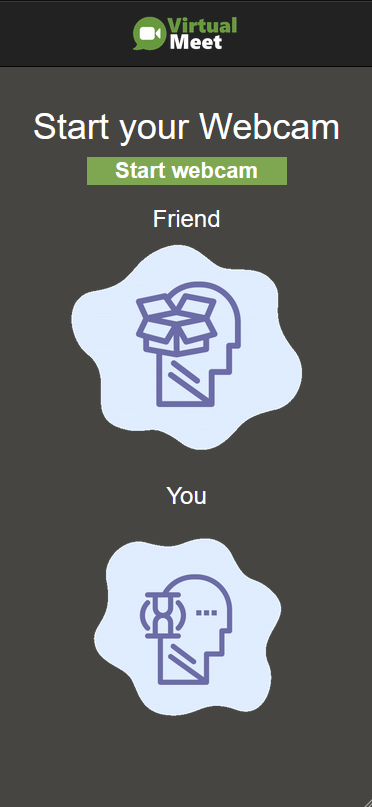
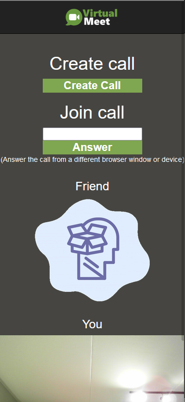
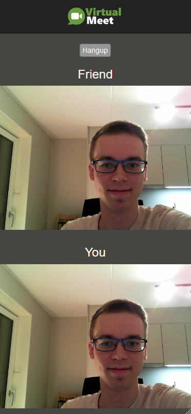
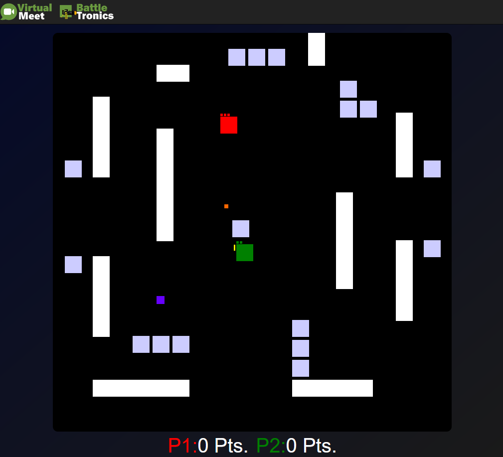
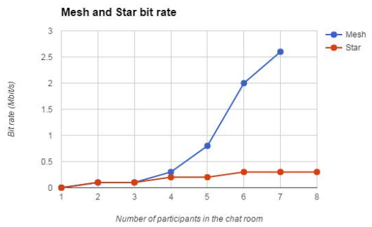

# VirtualMeet

_A low-latency video calling application_

  
   
   
   

Try it out live (use two devices): https://virtualmeetrtc.herokuapp.com/

## Run the code yourself:

1. Navigate into the backend folder:

   - **cd backend**

2. Run the command:

   - **yarn install && yarn client-install**

3. Start the frontend (client) and backend (server) concurrently:

   - **yarn dev**

## A webRTC video chat app:

- Typescript
- Express
- Signaling Server - Firebase

## FEATURES:

A mesh network topology should work well up to 4 clients according to multiple sources.

- Mobile/tablet detection https://stackoverflow.com/questions/11381673/detecting-a-mobile-browser ✅
- Joystick for mobile: https://www.npmjs.com/package/react-joystick-component ✅
- Add more features from Steam game: https://github.com/Christofferos/4PlayerLocalGame 
- Add timer to environment events
- Challenge someone that is online to play with
- Add images with base64: https://onlinepngtools.com/convert-png-to-base64 ✅
- Make game playable for 4 clients✅
- Scale down video if device width is smaller than output video ✅
- Allow for more than 2 people to join the call (WebRTC Media Server - group calls)
- Talk | Virtual Meet | Play ✅
- Improve design and interface ✅
- Publish on Heroku ✅
- Idea: What is the object? Recognition (https://www.youtube.com/watch?v=01sAkU_NvOY)
  (https://data-flair.training/blogs/data-science-project-ideas/)

Bit rate results from N clients in mesh network (marked in blue)

## Deep Dive - Details:

**_Caller_**:

1. Start a webcam feed
2. Create an ‘RTCPeerConnection` connection
3. Call createOffer() and write the offer to the database
4. Listen to the database for an answer
5. Share ICE candidates with other peer
6. Show remote video feed

**_Callee_**:

1. Start a webcam feed
2. Create an ‘RTCPeerConnection` connection
3. Fetch database document with the offer.
4. Call createAnswer(), then write answer to database.
5. Share ICE candidates with other peer
6. Show remote video feed

**Firebase:** will work as a 3rd party server is required for signaling that stores shared data for
stream negotiation
